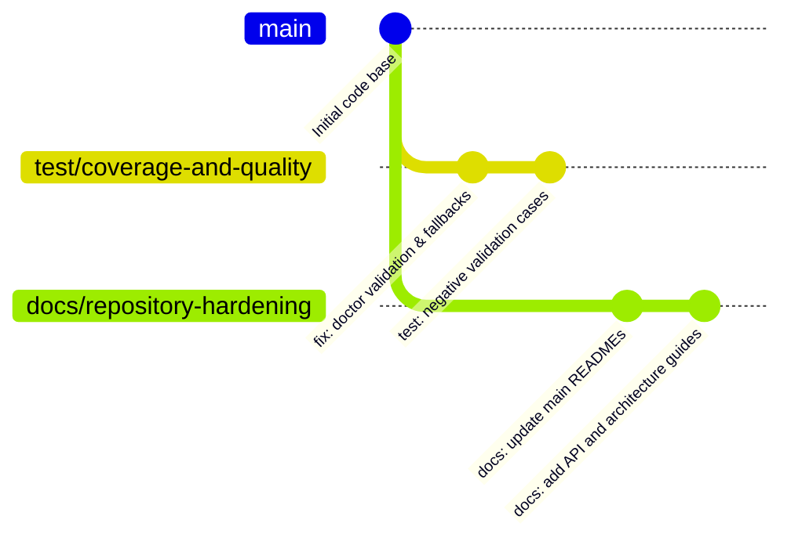

# Release Merge Plan

This document outlines the step-by-step strategy for merging the quality assurance (`test/coverage-and-quality`) and documentation (`docs/repository-hardening`) branches back into the `main` production branch.

---

## 1. Branch Hierarchy



---

## 2. Step-by-Step Merge Sequence

To ensure zero regression and a clean linear git history:

### Step 1: Sync and Validate `test/coverage-and-quality`
Merge/rebase the QA branch first to ensure that code validations and test cases are integrated into `main`.

1. Switch to `main` and pull the latest changes:
   ```bash
   git checkout main
   git pull origin main
   ```
2. Switch to the test branch and rebase on top of `main`:
   ```bash
   git checkout test/coverage-and-quality
   git rebase main
   ```
3. Run the Docker verification pipeline locally to confirm all 36 tests pass:
   ```bash
   docker compose -f tests/docker-compose.test.yml up --build --exit-code-from test-runner
   ```
4. Push the test branch and verify that GitHub Actions CI builds pass:
   ```bash
   git push origin test/coverage-and-quality --force-with-lease
   ```

### Step 2: Merge QA into `main`
Once the CI pipeline is green, merge the test branch:
1. Switch to `main`:
   ```bash
   git checkout main
   ```
2. Merge the branch (using fast-forward):
   ```bash
   git merge test/coverage-and-quality --ff-only
   ```
3. Push `main` to origin:
   ```bash
   git push origin main
   ```

### Step 3: Rebase and Merge `docs/repository-hardening`
With the code in `main` updated, we now update the documentation branch.

1. Switch to the docs branch:
   ```bash
   git checkout docs/repository-hardening
   ```
2. Rebase on top of the updated `main`:
   ```bash
   git rebase main
   ```
3. Resolve any trivial conflicts (e.g. README updates), and verify tests:
   ```bash
   docker compose -f tests/docker-compose.test.yml up --build --exit-code-from test-runner
   ```
4. Push the docs branch:
   ```bash
   git push origin docs/repository-hardening --force-with-lease
   ```
5. Merge docs branch into `main`:
   ```bash
   git checkout main
   git merge docs/repository-hardening --ff-only
   git push origin main
   ```

---

## 3. Post-Merge Verification & Tagging
Once both branches are merged:
1. Tag the release on `main` branch (e.g., `v1.0.0-rc1`):
   ```bash
   git tag -a v1.0.0-rc1 -m "Release Candidate 1: validations, tests, and guides"
   git push origin v1.0.0-rc1
   ```
2. Clean up local/remote branch tracking:
   ```bash
   git branch -d test/coverage-and-quality
   git branch -d docs/repository-hardening
   ```
