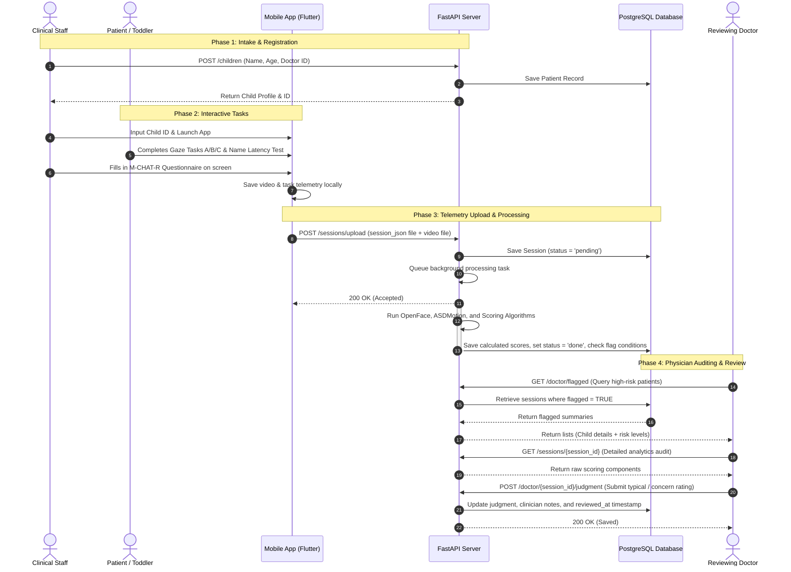

# AutiScreen Clinical Workflow & API Flow Diagrams

This document illustrates the sequence of clinical and technological steps during a child's screening lifecycle.

---

## 1. The Clinical Cycle

---

## 2. API Endpoint Interaction Flow

Here is a summary of the routes invoked during this clinical lifecycle:

1. **`POST /children`**: Run at intake by nurse or clinic clerk to capture names, age, and assigned physician.
2. **`POST /sessions/upload`**: Run automatically by the tablet application once the toddler finishes tasks. Starts the background ML task immediately.
3. **`GET /doctor/flagged`**: Polled or loaded by clinicians on the web dashboard to see what reviews are pending.
4. **`GET /sessions/{session_id}`**: Triggered when a clinician clicks a patient row in the dashboard to review their radar chart and scoring profile.
5. **`POST /doctor/{session_id}/judgment`**: Saved when the clinician clicks "Submit Evaluation" on the patient's record.
