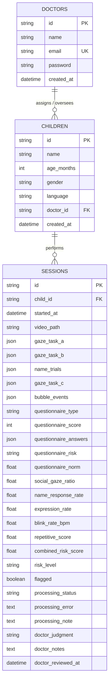

# Database Schema Reference

AutiScreen stores patient details, clinical session metrics, raw task event telemetry, and physician judgments in a relational database. 

---

## 1. Entity-Relationship (ER) Diagram

---

## 2. Table Specifications

### 2.1 Table: `doctors`
Stores clinician credentials and profiles.

| Column Name | Data Type | Constraints | Description |
| :--- | :--- | :--- | :--- |
| `id` | String | Primary Key | Unique UUID |
| `name` | String(100) | - | Doctor's full name |
| `email` | String(200) | Unique, Not Null | Email address (used for credentials) |
| `password` | String(200) | Not Null | Bcrypt hashed password string |
| `created_at` | DateTime | Default `utcnow()` | Registration timestamp |

---

### 2.2 Table: `children`
Stores patient information.

| Column Name | Data Type | Constraints | Description |
| :--- | :--- | :--- | :--- |
| `id` | String | Primary Key | Unique UUID |
| `name` | String(100) | Not Null | Child's full name (non-empty validation) |
| `age_months` | Integer | Not Null | Child's age in months ($1 \le \text{age} \le 120$) |
| `gender` | String(10) | - | Child's biological sex (e.g. `M`/`F`) |
| `language` | String(5) | Default `"en"` | Language code for screen tasks (supported codes only) |
| `doctor_id` | String | Foreign Key | References `doctors.id` (Nullable) |
| `created_at` | DateTime | Default `utcnow()` | Patient registration timestamp |

---

### 2.3 Table: `sessions`
Stores telemetry from testing, extracted landmarks, computed metrics, and doctor diagnostics.

| Column Name | Data Type | Constraints | Description |
| :--- | :--- | :--- | :--- |
| `id` | String | Primary Key | Session UUID |
| `child_id` | String | FK, Not Null | References `children.id` |
| `started_at` | DateTime | Default `utcnow()` | Testing execution start time |
| `video_path` | String | Nullable | Path to the recorded video file |
| `gaze_task_a` | JSON | Default `[]` | Raw social preference task telemetry |
| `gaze_task_b` | JSON | Default `[]` | Raw name response task telemetry |
| `name_trials` | JSON | Default `[]` | Click/timing records for name trials |
| `gaze_task_c` | JSON | Default `[]` | Raw imitation task gaze coordinates |
| `bubble_events` | JSON | Default `[]` | Interaction and touch coordinate events |
| `questionnaire_type` | String(20) | - | Type of screen (`mchat_r` or `indt_asd`) |
| `questionnaire_score` | Integer | - | Sum score of the survey questionnaire |
| `questionnaire_answers`| JSON | Default `{}` | Key-value mapping of raw answers |
| `questionnaire_risk` | String(10) | - | Questionnaire risk calculation: `low`, `medium`, `high` |
| `questionnaire_norm` | Float | - | Normalised score scaled between $0.0$ and $1.0$ |
| `social_gaze_ratio` | Float | - | Stimuli offset ratio (Perochon 2023 algorithm) |
| `name_response_rate` | Float | - | Ratio of trials where name was acknowledged |
| `expression_rate` | Float | - | Smile co-occurrence frequency ($AU06 \ge 1.0 \land AU12 \ge 1.5$) |
| `blink_rate_bpm` | Float | - | Eye blink rate in beats-per-minute |
| `repetitive_score` | Float | - | Stereotypical movements score from ASDMotion |
| `combined_risk_score` | Float | - | Final mathematical risk probability score ($0.0 \le S \le 1.0$) |
| `risk_level` | String(10) | - | Risk evaluation categorization: `low`, `medium`, `high` |
| `flagged` | Boolean | Default `False` | Alert flag for review when combined risk is high |
| `processing_status` | String(20) | Default `"pending"`| Queue states: `pending`, `processing`, `done`, `error`, `completed_fallback` |
| `processing_error` | Text | Nullable | Stacktrace or message from processing failures |
| `processing_note` | Text | Nullable | Pipeline execution details (e.g. fallback triggers) |
| `doctor_judgment` | String(20) | Nullable | Clinician evaluation: `typical`, `monitoring`, `high_concern`, `refer_immediately` |
| `doctor_notes` | Text | Nullable | Diagnostic notes added by doctor |
| `doctor_reviewed_at` | DateTime | Nullable | Review submit timestamp |
