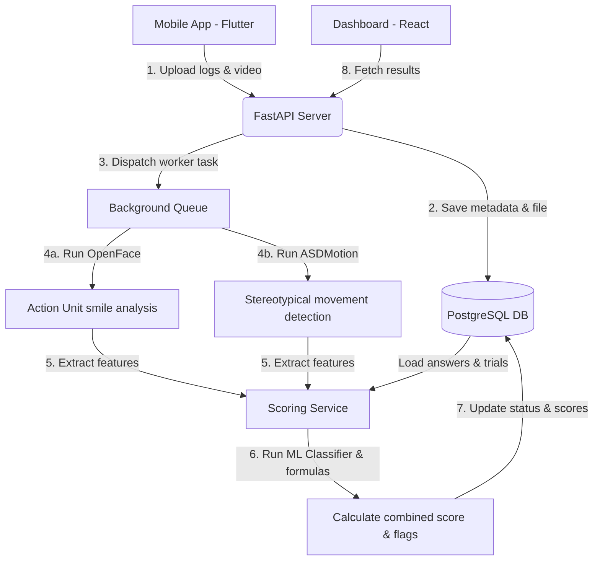
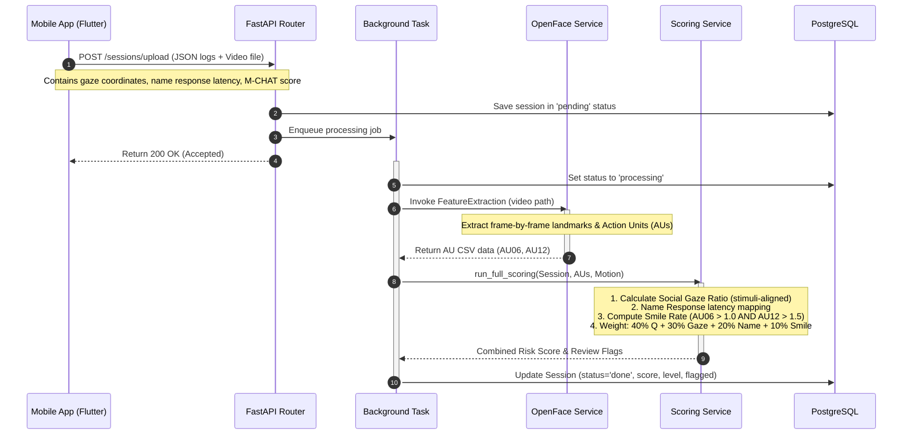

# System Architecture & Processing Pipeline

This document explains the data pipelines and processing algorithms implemented in AutiScreen.

---

## 1. High-Level Architectural Flow

AutiScreen combines client-side interactive visual tasks (mobile capture) with server-side computer vision and statistical analysis (ML and scoring engine).

---

## 2. Gaze + Smile Co-occurrence Detection Pipeline

The primary clinical marker for screening social reciprocity is the **co-occurrence of interactive gaze and social smiles**.

### Step-by-Step Sequence:

### Analysis Algorithms:
1. **Social Gaze Ratio:** Calculates the percentage of frames where the child's coordinate offset from the target stimulus was below the clinical threshold ($d \le 0.45$).
2. **Name Response Rate:** Checks latency in trials where the child's name was called. If response latency exceeds thresholds or child did not respond, it increments risk.
3. **Genuine Social Smile Detection:** Standard OpenFace FACS (Facial Action Coding System) criteria:
   $$\text{Genuine Smile} = (\text{AU06\_r} \ge 1.0) \land (\text{AU12\_r} \ge 1.5)$$
   The co-occurrence rate measures what proportion of gaze task attention matches the presence of a genuine smile.
4. **ASDMotion:** Uses Pose/Movement estimation tracking to check frequency of repetitive limb or torso patterns, outputting a movement score.
